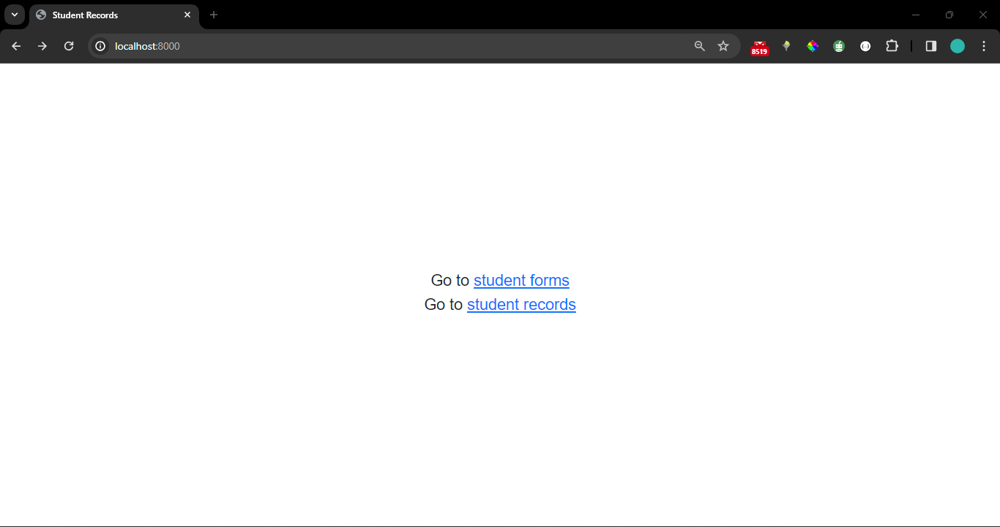
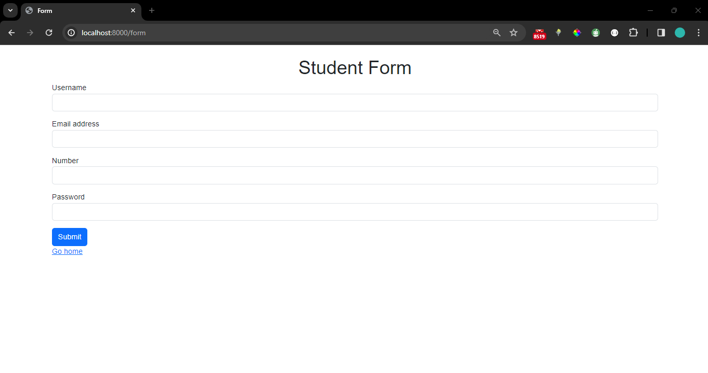
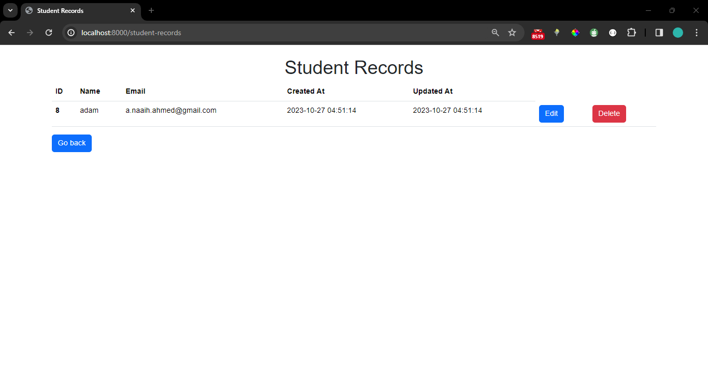

## Crud Application 

first time crud application on laravel

### screenshots:

1. home

2. form

3. records table

### to do: 
1. reset id counter when all data is deleted. starting id count from one.
2. add pagination when the table listing starts to increase.